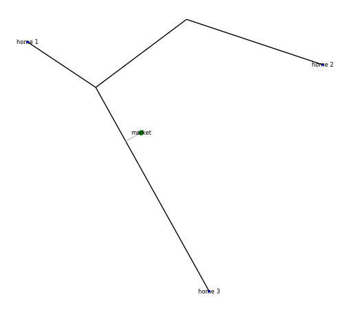

.. _step-by-step-usage-guide:

Step-by-Step Usage Guide
========================

This step-by-step usage guide walks through building and running a PiperABM model.
This guide is designed to help the user to understand the basic steps of 

.. _installation:

Installation
--------------------------------
Install the package using pip:

.. code-block:: bash

    pip install piperabm

.. _step-0-create-the-model:

Step 0: Create the Model
--------------------------------
In this first step, we import the PiperABM package and create a `Model` instance. We provide:

- **path**: The directory where simulation files are saved and loaded (using the location of this example file is recommended).
- **seed** (optional): An integer for reproducible random number generation.
- **prices**: A dictionary mapping resource names (e.g., `'food'`, `'water'`, `'energy'`) to their unit costs.
- **name** (optional): A label to distinguish this model and its results when running multiple instances. In single runs, this can left empty.

.. code-block:: python

    import os
    import piperabm as pa

    path = os.path.dirname(os.path.realpath(__file__))
    model = pa.Model(
        path=path,
        seed=2,
        prices={'food': 15, 'water': 2, 'energy': 8},
        name="Example Model"
    )

The model instance is now ready to be used in the subsequent steps.

.. _step-1-build-infrastructure:

Step 1: Build the Infrastructure
--------------------------------
Now we will create the infrastructure for our model.
Once the model instance is created, automatically an instance of `Infrastructure` is created and assigned to `model.infrastructure`. This instance will be used to build the infrastructure.
Infrastructure elements include:

- **Market**: A node where resources are bought and sold. They act as social hubs in the model. The influx of resources to the model only happens through markets.
- **Homes**: Nodes where agents live and belong to.
- **Junctions**: Nodes that connect edges in the network and represent a physical point in the world.
- **Streets**: Edges that are used by agents to move around the simulation world.
- **Neighborhood Access**: Edges that connect homes and markets to the street network, allowing agents to access these nodes.

The nodes are defined by their position in the world (`pos`), whereas edges are defined by their start and ending positions (`pos_1` and `pos_2`). All the elements can have an optional name and are assigned a unique ID automatically, if no unique ID is given manually.

To build the infrastructure, we can either manually add elements:

.. code-block:: python
    
    # Option 1: Manually add all elements
    # (Figure 1)
    model.infrastructure.add_home(pos=[-60, 40], name='home 1', id=1)
    model.infrastructure.add_home(pos=[200, 20], name='home 2', id=2)
    model.infrastructure.add_home(pos=[100, -180], name='home 3', id=3)
    model.infrastructure.add_street(pos_1=[-60, 40], pos_2=[0, 0], name='street 1')
    model.infrastructure.add_street(pos_1=[0, 0], pos_2=[80, 60], name='street 2')
    model.infrastructure.add_street(pos_1=[80, 60], pos_2=[200, 20], name='street 3')
    model.infrastructure.add_street(pos_1=[0, 0], pos_2=[100, -180], name='street 4')
    model.infrastructure.add_market(
        pos=[40, -40],
        name='market',
        id=0,
        resources={'food': 150, 'water': 220, 'energy': 130}
    )

.. figure:: _static/step-by-step/step_1_automatic.png
   :alt: An example of manually defined infrastrcuture
   :align: center

   **Figure 1:** An example of manually defined infrastructure, after the baking process. The figure is from `Manual Creation <https://github.com/cmudrc/pied-piper/blob/main/examples/manual-creation/README.md>`_ example.

...  or use the methods to automatically generate the infrastructure. The generator method creates a gridworld for streets and randomlly distribute homes. It does NOT create market nodes:

- **homes_num**: Number of homes to be generated.
- **grid_size**: Size of the grid in meters provided as list of two numbers showing the width and height of the grid.
- **grid_num**: Number of grid cells in the provided as a list of two integers showing number of cells in the width and height of the world.
- **imperfection_percentage**: Percetnage of random imperfections in the world. This is used to create a more realistic world by introducing some randomness in the grid structure. The percentage is calculated based on the length of the removed edges.

.. code-block:: python
    
    # Option 2: Automatically generate the infrastructure.
    # (Figure 2)
    model.infrastructure.generate(
        homes_num=20,
        grid_size=[15, 10],  # Meters
        grid_num=[6, 6],  # Meters
        imperfection_percentage=10  # Percentage of imperfection in the grid
    )
    model.infrastructure.add_market(
        pos=[0, 0],
        name='market',
        id=0,
        resources={'food': 150, 'water': 220, 'energy': 130}
    )

   **Figure 2:** An example of automatically generated infrastructure, after the baking process. The grid is created with some imperfections, and a market node is added to the center of the environment and the homes are randomly placed. The figure is borrowed from `Automatic Creation <https://github.com/cmudrc/pied-piper/blob/main/examples/automatic-creation/README.md>`_ example.

For further details on how to load infrastrcuture using satellite data and maps, refer to the :ref:`Working with Satellite Data <working-with-satellite-data>`.

Before going to the next step, we need to "bake" the infrastructure. The process of baking finalizes the infrastructure setup that involves applying certain graph grammars to create a physically sensinble network.

- **proximity_radius**: The grammar rules use this value to determine how close the elements should be to each other to impact each other, such as getting merged.
- **search_radius** (optional): Home and market nodes need to get connected to the street network. This is done using "Neighborhood access" edges. The grammar rule for this process is computationally expensive therefore setting a search radius can speed up the process specially in large and intricate networks. If set to `None`, all possible elements are network are evaluated.
- **report**: Reports show the steps taken during the baking process, which can be useful for debugging or understanding the model.

.. code-block:: python

    model.infrastructure.bake(
        proximity_radius=5,  # Meters
        search_radius=200,  # Meters
        report=True
    )

When the infrastructure is baked, it is ready to be used
User can visualize the infrastructure using the `show` method, and by printing the infrastructure object directly, they can see a summary of the infrastructure elements.

.. code-block:: python

    # Print the infrastructure summary
    print(model.infrastructure)

    # Visualize the infratructure
    model.infrastructure.show()

The infrastructure elements are subject to degradation. There are two types of degradation:
- **Age**: The age of the element increases over time which causes the element loose efficiency.
- **Usage**: The more an element is used, the more it degrades.

By default, only the street edges are sibject to degradation. However, the user can customize the degradation process by creating a `degradation.py` file in the working directiry.

.. code-block:: python

    # Print the infrastructure summary
    ...

.. _step-2-build-society:

Step 2: Build the Society
--------------------------------
In this step, we will create the society for our model.
Once the model instance is created in step 0, automatically an instance of `Society` is created and assigned to `model.society`. This instance will be used to build the society.
Society elements includes agents (as nodes) and their relationships (as edges). There are three types of relationships:
- family: The agents that have same home nodes assigned are considered as a family.
- neighbor: The agents that the assigned home nodes are closer than a certain distance are considered as neighbors.
- friend: This type of relationship is not automatically created and can be added later by the user.

To build the society, we can either manually add agents and their relationships:

.. code-block:: python

    # Option 1: Manually add all elements
    model.society.neighbor_radius = 500  # Meters
    homes = model.infrastructure.homes  # Homes id
    model.society.add_agent(
        home_id=homes[0],
        balance=1200,
        resources={'food': 15, 'water': 12, 'energy': 10},
    )
    model.society.add_agent(
        home_id=homes[1],
        balance=800,
        resources={'food': 15, 'water': 12, 'energy': 10},
    )
    model.society.add_agent(
        home_id=homes[1],
        balance=1100,
        resources={'food': 15, 'water': 12, 'energy': 10},
    )
    model.society.add_agent(
        home_id=homes[2],
        balance=900,
        resources={'food': 15, 'water': 12, 'energy': 10},
    )

The code above is from `Manual Creation <https://github.com/cmudrc/pied-piper/blob/main/examples/manual-creation/README.md>`_ example.

The other method is to automatically generate the society. The generator method creates a society with a given number of agents and other attributes of the society like the Gini index (a measure of inequality), average income, etc.

.. code-block:: python
    
    # Option 2: Automatically generate the society.
    model.society.generate(
        num=50,
        gini_index=0.3,
        average_resources={'food': 10,'water': 10,'energy': 10},
        average_balance=1000,
    )

.. _step-3-run:

Step 3: Run
--------------------------------
The current state of the model at this stage, where everything is loaded are is ready for running but the run is not started yet, is also called "initial".

.. _step-4-results:

Step 4: Results
--------------------------------
...
