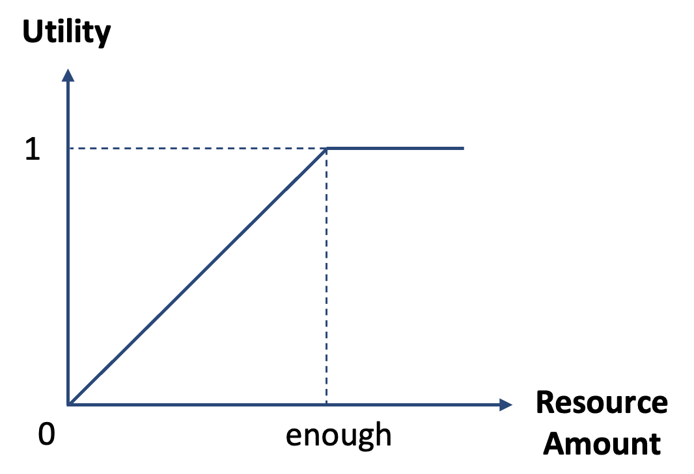

.. _step-by-step-usage-guide:

Step-by-Step Usage Guide
================================

This step-by-step usage guide walks through building and running a PiperABM model.
This guide is designed to help the user to understand the logic and best practices.

.. _step-0-create-the-model:

Step 0: Create the Model
--------------------------------
In this first step, we import the PiperABM package and create a :class:`piperabm.Model` instance and provide the parameters.

.. code-block:: python

    import os
    import piperabm as pa

    path = os.path.dirname(os.path.realpath(__file__))
    model = pa.Model(
        path=path,
        seed=2,
        prices={'food': 15, 'water': 2, 'energy': 8},
        name="Example Model"
    )

The model instance is now ready to be used in the subsequent steps.

.. _step-1-build-infrastructure:

Step 1: Build the Infrastructure
--------------------------------
Now we will create the infrastructure for our model.
When you create a :class:`piperabm.Model` instance, the `infrastructure` attribute on that instance is automatically set to a fresh :class:`piperabm.infrastructure.Infrastructure` object.
Infrastructure elements include:

- **Market**: A node where resources are bought and sold. They act as social hubs in the model. The influx of resources to the model only happens through markets. (for more info, see :meth:`~piperabm.infrastructure.Infrastructure.add_market`)
- **Homes**: Nodes where agents live and belong to. (for more info, see :meth:`~piperabm.infrastructure.Infrastructure.add_home`)
- **Junctions**: Nodes that connect edges in the network and represent a physical point in the world. (for more info, see :meth:`~piperabm.infrastructure.Infrastructure.add_junction`)
- **Streets**: Edges that are used by agents to move around the simulation world. (for more info, see :meth:`~piperabm.infrastructure.Infrastructure.add_street`)
- **Neighborhood Access**: Edges that connect homes and markets to the street network, allowing agents to access these nodes. (for more info, see :meth:`~piperabm.infrastructure.Infrastructure.add_neighborhood_access`)

The nodes are defined by their position in the world (`pos`), whereas edges are defined by their start and ending positions (`pos_1` and `pos_2`). All the elements can have an optional name and are assigned a unique ID automatically, if no unique ID is given manually.

To build the infrastructure, we can either manually add elements:

.. code-block:: python
    
    # Option 1: Manually add all elements
    # (Figure 1)
    model.infrastructure.add_home(
        pos=[-60, 40],
        name='home 1',
        id=1
    )
    model.infrastructure.add_home(
        pos=[200, 20],
        name='home 2',
        id=2
    )
    model.infrastructure.add_home(
        pos=[100, -180],
        name='home 3',
        id=3
    )
    model.infrastructure.add_street(
        pos_1=[-60, 40],
        pos_2=[0, 0],
        name='street 1'
    )
    model.infrastructure.add_street(
        pos_1=[0, 0],
        pos_2=[80, 60],
        name='street 2'
    )
    model.infrastructure.add_street(
        pos_1=[80, 60],
        pos_2=[200, 20],
        name='street 3'
    )
    model.infrastructure.add_street(
        pos_1=[0, 0],
        pos_2=[100, -180],
        name='street 4'
    )
    model.infrastructure.add_market(
        pos=[40, -40],
        name='market',
        id=0,
        resources={'food': 150, 'water': 220, 'energy': 130}
    )

.. figure:: _static/step-by-step/step_1_manual.png
   :alt: An example of manually defined infrastrcuture
   :align: center

   **Figure 1:** An example of manually defined infrastructure, after the baking process. The figure is from `Manual Creation <https://github.com/cmudrc/pied-piper/blob/main/examples/manual-creation>`_ example.

...  or use the methods to automatically generate the infrastructure. The generator method creates a gridworld for streets and randomlly distribute homes. It does NOT create market nodes. For more details, visit :meth:`~piperabm.infrastructure.Infrastructure.generate`.

.. code-block:: python
    
    # Option 2: Automatically generate the infrastructure.
    # (Figure 2)
    model.infrastructure.generate(
        homes_num=20,
        grid_size=[15, 10],  # Meters
        grid_num=[6, 6],  # Meters
        imperfection_percentage=10  # Percentage of imperfection
    )
    model.infrastructure.add_market(
        pos=[0, 0],
        name='market',
        id=0,
        resources={'food': 150, 'water': 220, 'energy': 130}
    )

.. figure:: _static/step-by-step/step_1_automatic.png
   :alt: An example of automatically generated infrastrcuture
   :align: center

   **Figure 2:** An example of automatically generated infrastructure, after the baking process. The grid is created with some imperfections, and a market node is added to the center of the environment and the homes are randomly placed. The figure is borrowed from `Automatic Creation <https://github.com/cmudrc/pied-piper/blob/main/examples/automatic-creation>`_ example.

For further details on how to load infrastrcuture using satellite data and maps, refer to the :ref:`Working with Satellite Data <working-with-satellite-data>`.
Before continuing to the next step, we need to "bake" the infrastructure. The process of baking finalizes the infrastructure setup that involves applying certain graph grammars to create a physically sensinble network. For more information, please visit :meth:`~piperabm.Model.bake`.

.. code-block:: python

    model.infrastructure.bake(
        proximity_radius=5,  # Meters
        search_radius=200,  # Meters
        report=True
    )

When the infrastructure is baked, it is ready to be used.
User can visualize the infrastructure using the `show` method, and by printing the infrastructure object directly, they can see a summary of the infrastructure elements.

.. code-block:: python

    # Print the infrastructure summary
    print(model.infrastructure)

    # Visualize the infratructure
    model.infrastructure.show()

The infrastructure elements are subject to degradation. There are two types of degradation:

- **Age**: The age of the element increases over time which causes the element loose efficiency.
- **Usage**: The more an element is used, the more it degrades.

Each degradable element has a `usage_impact` and `age_impact` attributes that are used to calculate the degradation of the element.
When edges degrade, they become less efficient, therefore, it will take longer for the agents to travel through them and require more resources to do so. This is equivalent of having longer edges. This is called "adjusted length" and is calculated as follows:

.. math::

    adjusted\_length = length \times adjustment\_factor

The adjustement factor is calculate using the `calculate_adjustment_factor` method of the `Degradation` class. This method takes `usage_impact` and `age_impact` of the element, and by combining them with the `coeff_age` and `coeff_usage` attributes, calculates the "adjustement factor".
By default, only the street edges are sibject to degradation. However, the user can customize the degradation process by creating a `degradation.py` file in the working directory:

.. code-block:: python

    # The file name should be `degradation.py` and it needs to be located in the wokring directory of the simulation.
    from piperabm.infrastrcuture.degradation import Degradation

    class CustomDegradation(Degradation):

        def calculate_adjustment_factor(self, usage_impact: float, age_impact: float) -> float:
            """
            Calculate adjustment factor using a custom formula.
            """
            return 1 + (self.coeff_usage * usage_impact ** 1.2) + (self.coeff_age * age_impact)

.. _step-2-build-society:

Step 2: Build the Society
--------------------------------
In this step, we will create the society for our model.
Once the user create a :class:`piperabm.Model` instance in step 0, the `society` attribute on that instance is automatically set to a fresh :class:`piperabm.society.Society` object. This instance will be used to build the society.
Society elements includes agents (as nodes) and their relationships (as edges). There are three types of relationships:

- **family:** The agents that have same home nodes assigned are considered as a family.
- **neighbor:** The agents that the assigned home nodes are closer than a certain distance are considered as neighbors.
- **friend:** This type of relationship is not automatically created and can be added later by the user.

To build the society, we can either manually add agents and their relationships:

.. code-block:: python

    # Option 1: Manually add all elements
    model.society.neighbor_radius = 500  # Meters
    homes = model.infrastructure.homes  # Homes id
    model.society.add_agent(
        home_id=homes[0],
        balance=1200,
        resources={'food': 15, 'water': 12, 'energy': 10},
    )
    model.society.add_agent(
        home_id=homes[1],
        balance=800,
        resources={'food': 15, 'water': 12, 'energy': 10},
    )
    model.society.add_agent(
        home_id=homes[1],
        balance=1100,
        resources={'food': 15, 'water': 12, 'energy': 10},
    )
    model.society.add_agent(
        home_id=homes[2],
        balance=900,
        resources={'food': 15, 'water': 12, 'energy': 10},
    )

The code above is from `Manual Creation <https://github.com/cmudrc/pied-piper/blob/main/examples/manual-creation>`_ example.

The other method is to automatically generate the society. The generator method creates a society with a given number of agents and other attributes of the society like the Gini index (a measure of inequality), average income, etc.

.. code-block:: python
    
    # Option 2: Automatically generate the society.
    model.society.generate(
        num=50,
        gini_index=0.3,
        average_resources={'food': 10,'water': 10,'energy': 10},
        average_balance=1000,
    )

Agents consume resources both during travel and from their routine activities; should any of their essential resources (food, water, or energy) drop to zero, the agent is considered “dead” and is removed from the simulation, serving as a critical endpoint that reflects a failure to sustain the population under stress.

   **Figure X:** Agents’ satisfaction exhibits diminishing returns, plateauing once their resource inventories surpass a predefined “enough” threshold.

.. _step-3-run:

Step 3: Run
--------------------------------

When the model runs, the agents use infrastructure to interact with each other and the environment to gain access to resources. The model runs in descrete time steps, where each step represents a unit of time.
During each run step, agents first perform a cost–benefit analysis to choose a destination, initially targeting the nearest market nodes to minimize travel time and resource expenditure . They then navigate through the infrastructure network using the A* algorithm, which finds the shortest path by combining actual travel costs with heuristic estimates . Upon arrival, agents may trade resources either at market nodes or with other agents present; these exchanges are resolved via the Nash Bargaining Solution, which ensures a fair division by maximizing the product of each party’s utility gain over their disagreement points.
Infrastructure elements will degrade as a result of both aging usage. Agents activity will cause degradation of infrastrcuture elements. This feedback loop means that heavily trafficked routes become progressively slower and more costly to traverse.

.. figure:: _static/step-by-step/interconnected.png
   :alt: Interconnected nature of infrastructure and society networks
   :align: center

   **Figure X:** PiperABM models the interconnected nature of infrastructure and society networks.

The :meth:`~piperabm.Model.run` method of the :class:`piperabm.Model` class is used for running the simulation. An example of running the model is as follows:

.. code-block:: python

    # Run the simulation
    model.run(save=True, save_transactions=True, n=100, step_size=3600)

.. _step-4-results:

Step 4: Results
--------------------------------

When simulation running is done, if the `save` attribute is `True`, the states of model accross the time steps will be saved. (For more information, please refer to :meth:`~piperabm.Model.run`)
Now, is it possible to create an instance of :class:`piperabm.model.Measurement` to measure the various parameters for the length of simulation. Currently, "accessibility" and "travel distance" are supported. (For more information, please refer to :class:`piperabm.model.measurement.accessibility.Accessibility` and :class:`piperabm.model.measurement.travel_distance.TravelDistance`)
The measured values will be saved to disk for future reference.

.. code-block:: python

    import os
    import piperabm as pa

    path = os.path.dirname(os.path.realpath(__file__))
    measurement = pa.Measurement(path=path)
    measurement.measure()

Then, we can access the measurements later:

.. code-block:: python

    import os
    import piperabm as pa

    path = os.path.dirname(os.path.realpath(__file__))
    measurement = pa.Measurement(path=path)
    measurement.load()
    measurement.accessibility.show()
    measurement.travel_distance.show()

It is also possible to access and filter the values to create customized plots. Please refer to the corresponding documentation.

Another way of working with the simulation results is to render animation. This is useful for face-validity but requires setting proper step-size for smooth animation.

.. code-block:: python

    import os
    import piperabm as pa

    path = os.path.dirname(os.path.realpath(__file__))
    model = pa.Model(path=path)
    model.animate()

Moreover, it is possible to load the initial state of model, and push it step by step forward. Any time along the process, it is possible to read the internal values, such as position of agents and the amount of balance they have.

.. code-block:: python

    import os
    import piperabm as pa

    path = os.path.dirname(os.path.realpath(__file__))
    model = pa.Model(path=path)
    model.load_intial()
    for _ in range(10):
        model.push()  # Push the model one step forward using the saved information
        print(model.society.get_balance(id=4153))  # Check the balance for a certain agent

Another useful method is to directly accessing the backend for networks. The :class:`piperabm.infrastructure.Infrastructure` class uses a `NetworkX Undirected Graph <https://networkx.org/documentation/stable/reference/classes/graph.html>`_ as its backend and can be directly accessed as follows:

.. code-block:: python

    # NetworkX undirected graph backend for infrastructure
    G = model.infrastrcuture.G

The :class:`piperabm.society.Society` class uses a `NetworkX Undirected Multi Graph <https://networkx.org/documentation/stable/reference/classes/multigraph.html>`_ as its backend and can be directly accessed as follows:

.. code-block:: python

    # NetworkX undirected multi graph backend for society
    G = model.society.G
