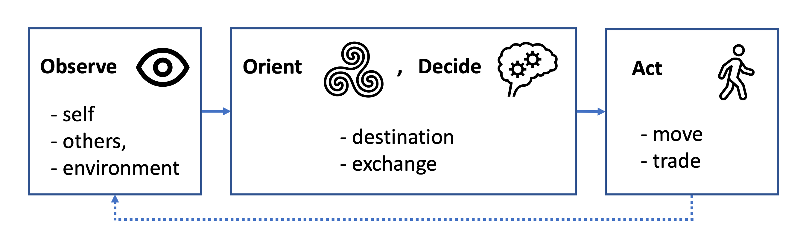

# Summary

`PiperABM` is an open-source Python library for building resilience-focused agent-based simulations on coupled infrastructure–society networks. Infrastructure (roads, homes, markets) is represented as a spatial graph that can progressively degrade; travel cost grows via an International Roughness Index (IRI)-inspired factor that inflates effective edge length over time, capturing both human wear and environmental stress. Agents decide with a lightweight Observe–Orient–Decide–Act loop and can be extended with custom policies, enabling rapid experimentation with behavioral assumptions. The library ingests real geospatial inputs (latitude/longitude from satellite or map data), projects them with a Mercator projection to a Cartesian grid, and instantiates city layouts directly in the model. Built-in utilities report resource accessibility and traveled distance, and the evolving system can be visualized via integrated animation rendering. PiperABM is a pure-Python, framework-agnostic package that interoperates with the scientific Python ecosystem (e.g., NumPy and Matplotlib), making it easy to embed in scripts and services.

# Statement of Need

Infrastructure resilience is a critical concern for urban planners and researchers seeking to understand how disruptions (e.g., natural hazards) affect community access to essential services.

# How it works

The **piperabm** framework couples two dynamically interacting networks:

1. **A spatial infrastructure network** that carries physical flows, like roads for mobility and a simplified Food–Energy–Water (FEW) supply chain for basic needs.  
2. **A social network of autonomous agents** whose daily decisions, movements, and exchanges both depend on and reshape the physical system.

The elements of these networks affect each other during each step of the simulation run, reflecting the intertwined nature of the dynamics. This simulation emulates the day-to-day life of the community, capturing how individuals interact with both infrastructure and each other as they pursue essential activities and respond to ongoing changes in their environment.

## Infrastructure

The modeling workflow begins by constructing a representation of the city’s civil infrastructure system, hereafter referred to simply as the *infrastructure*.  In the current work this term encompasses the physical assets that underpin service domains most critical to day-to-day community resilience, namely transportation and the Food–Energy–Water (FEW) supply chain. We abstract these assets into a spatial network comprising three classes of location nodes:

- Junctions: A placeholder in space with physical coordinates as their only attributes, such as where two streets intersect.
- Homes: Representing agents’ residences, home nodes are where agents belong and reside within the community. These home nodes represent residential locations where agents reside, rest, and engage in family activities.
- Markets: These nodes represent local supermarkets that act as central hubs for the community’s grocery shopping needs. The market nodes represent a generalized resource‐influx point where essential food and goods enter the system, whether via imported supplies or local subsistence activities

{ I want to say it is possible to load city maps using satelite images and it has capability of converting lat long using mercator. }

## Society

The agents’ decision-making processes in our model are governed by the OODA loop [@Johnson02012023]. This framework, which stands for Observe, Orient, Decide, and Act, is particularly effective in modeling the complex cognitive behaviors of humans, as it encompasses a broad range of cognitive activities [@brehmer_dynamic_nodate].

User can customize it by supplying their own `decision_making.py` modules.

## Results

The result of simulation, for the matter of storage efficiency, is saved using data differencing [@Noorghasemi_KeepDelta_A_Python_2025]. The transactions between agents are also saved seperately. Is is also possible to generate results below using the integrated funtionalities.

### Animation

When the time step is sufficiently coarse, PiperABM can export an MP4 animation of the evolving infrastructure graph and agent trajectories.  These visualizations provide valuable *face validity*, a quick qualitative check that agents move sensibly, disruptions propagate plausibly, and global patterns match expectations.

### Accessiblity

Each agent’s accessibility to resources is assessed at every time step to monitor their well-being and ability to meet their needs. The term accessibility $A_{i,t,r}$ for agent $i$ at time $t$ for resource $r$ is computed as:

$$
A_{i,t,r} = \frac{R_{i,t}}{R^{\max}_{i}}
$$

where $R_{i,t}$ is the amount of resource $r$ that agent $i$ possesses at time $t$, and $R^{\max}_{i}$ is the maximum capacity of resource $r$ that agent $i$ can have. A value of 1 indicates full accessibility.

To aggregate across the *R* different resources for each agent, we use the geometric mean:

$$
A_{i,t} = \left(\prod_{r=1}^R A_{i,t,r}\right)^{\frac{1}{R}}
$$

This ensures that low accessibility in any single resource strongly impacts the overall score. If any $A_{i,t,r}=0$, then $A_{i,t}=0$ and the agent is considered dead.

Across all $N$ agents at each time step, the community’s average accessibility is:

$$
A_t = \frac{1}{N}\sum_{i=1}^N A_{i,t}
$$

Finally, a time-weighted overall accessibility over the simulation duration $T$ is

$$
A = \frac{\int_{0}^{T} A_t \,\mathrm{d}t}{\int_{0}^{T} A_{\max} \,\mathrm{d}t}
$$

where $A_{\max}=1$ is the maximum possible accessibility.

### Travel Distance

In the context of agent-based modeling, *traveled distance* serves as a metric for assessing the efficiency and functionality of transportation networks within a simulated environment. This measurement tracks the cumulative distance agents must traverse between various points, e.g. from home to market. 

When this measurement yields a low value, it indicates that the system is operating with high efficiency, allowing agents to traverse shorter distances between points to satisfy their needs. Alternatively, it could signal that various barriers, constraints, or issues are impeding agents’ access to essential network nodes, thus limiting their ability to move freely within the system and reach their goals. This dual interpretation helps in diagnosing the underlying causes of system performance, guiding targeted improvements in urban planning and resource distribution.

# Comparison to Existing Tools

PiperABM’s strength lies in its opinionated support for resilience metrics, built-in animation utilities, and its minimal barrier for user-defined agent policies. Unlike Mesa or NetLogo, which require extensive boilerplate or domain-specific scripting, PiperABM users can implement new decision-making modules by inheriting from a common superclass. Compared to Repast, PiperABM remains lightweight and fully Pythonic, benefiting from the broad data science ecosystem without Java dependencies.

# Acknowledgements

This work was supported by the U.S. National Science Foundation (Grant RISE-1927718).

# References