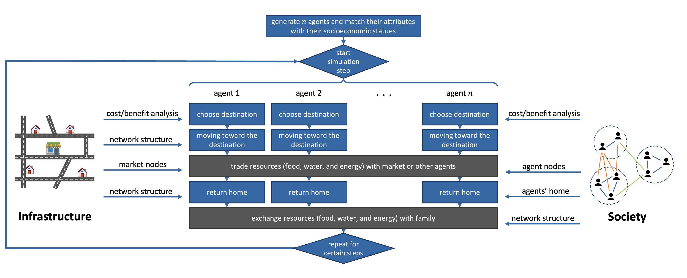

# Summary

_PiperABM_ is an open-source Python library for building agent-based simulations that couple human behavior with degrading infrastructure on real geospatial layouts. It provides lightweight primitives for agents with a customizable decision loop, infrastructure with spatial graphs whose effective travel costs evolve, and built-in analysis for accessibility to resources and travel distance, plus optional animation. Because it is implemented with familiar scientific tools like NumPy and NetworkX, researchers can inspect and extend models directly, integrate empirical data, and reuse standard workflows. PiperABM targets resilience questions where people’s choices and infrastructure conditions co-evolve, and it aims to reduce the setup overhead typical of one-off models while remaining flexible enough for diverse hazards, places, and policies.

# Statement of Need

Agent-based models (ABMs) represent systems “from the bottom up” via interacting, heterogeneous agents; macro-level patterns then emerge from local rules and interactions [@epstein1999; @epstein_axtell_1996; @schelling_2006]. Over the past two decades, ABM has matured from theoretical demonstrations to a practical research method supported by accessible tooling and the scientific Python ecosystem [@Mesa_3]. This paradigm is well-suited to infrastructure and community resilience, particularly within the Food–Energy–Water (FEW) nexus, where access to essential resources depends on both physical networks and human decisions, and where nonlinear feedbacks, thresholds, and cascades are common [@Xue2024; @Zhang2019; @CansinoLoeza2022].

Resilience studies pose several practical modeling needs that are not well served by ad hoc scripts or purely equation-based approaches:

- **Partial service levels and progressive degradation:** Models should represent graded performance (e.g., rougher roads increasing cost/time) rather than only binary failure, reflecting well-studied pavement deterioration processes and performance impacts, e.g., IRI-based assessments [@ASCE_Pavement_Performance_2020; @LlopisCastello2024].
- **Two-way coupling of behavior and infrastructure:** People adapt routes, priorities, and exchanges as networks evolve; these adaptations, in turn, load and degrade networks. Coupled human–infrastructure ABMs have demonstrated such feedbacks in flood-risk systems and related reviews emphasize capturing co-evolution [@Michaelis2020; @Anshuka2022].
- **Real geospatial layouts for place-based analysis:** Integrating GIS data (maps/satellite-derived inputs) enables site-specific scenarios and stakeholder communication; recent work in the Python ABM ecosystem formalizes GIS ingestion and spatial operations for ABMs [@MesaGeo2022].
- **Ensemble experiments and reproducibility:** Parameter sweeps, stochastic replications, and uncertainty and sensitivity analysis require clear, standardized reporting and careful data handling; community guidelines for documenting agent-based models and recent work on calibration and sensitivity analysis support replicable workflows [@GrimmODD2020; @McCulloch2022; @Razavi2021].
- **Custom metrics and analysis pipelines:** Exposing model state in familiar data structures should facilitate domain metrics, e.g., spatio-temporal accessibility to resources under disruption as used in recent resilience studies [@Tariverdi2023; @Enderami2024].

PiperABM is built to meet these needs. It offers simple building blocks in pure Python: A society network comprised of agents and their relationships; an infrastructure network that can wear down over time; tools to load real maps; and built‑in measures such as accessibility and travel distance, and optional animation for face-validity. With these pieces, researchers can quickly pose hypotheses, run “what‑if” scenarios, and study how people’s choices and the infrastructure around them influence one another and analyze socio-technical feedbacks.

Intended users are researchers and practitioners in infrastructure and community resilience, including urban planners, policymakers, and decision‑makers who need transparent, reproducible, place‑based simulations.

# Model Overview

At each time step, agents execute OODA-style decision-making logic that observe current conditions, orient, decide, and act [@brehmer_dynamic_ooda; @Johnson02012023_ooda]. Agents choose actions such as where to travel, whom to meet, and whether to trade. Routing between locations uses an A* search on the evolving network to approximate human‑like paths [@foead_systematic_2021]. Trades between agents are resolved using a Nash bargaining formulation [@nash_bargaining_1950]. Infrastructure elements degrade due to both exogenous aging and endogenous usage by agents, increasing effective travel cost and feeding back into subsequent decisions. Simulation results are stored using human‑readable delta differencing (KeepDelta), which is compact and easy to debug [@Noorghasemi_KeepDelta_A_Python_2025].

{#fig:overview}
*Figure 1.* The computational model of PiperABM emulates the relation between the elements of infrastructure and social networks.

# Comparison to Existing Tools

We group related work into two domains: (1) General frameworks intended to be reusable across problems, and (2) Purpose-built models created for a single, specific study.

## Domain 1: General frameworks (Python)

Mesa is a widely used general-purpose ABM framework that makes it easy to define agents, schedule steps, collect data, and visualize models in the browser, ideal for rapid prototyping and analysis [@Mesa_3]. Trade-off: domain logic is do-it-yourself; researchers typically hand-roll infrastructure degradation, accessibility metrics, and behavior–infrastructure coupling. InfraRisk is an infrastructure-centric Python platform for interdependent networks (power, water, transport) with hazard, cascade, recovery, and resilience modules that is strong on network physics and restoration [@InfraRisk]. Human decision-making and accessibility-driven behavior are typically added on top, so tight socio-technical feedbacks can be awkward. Repast4Py is a Python interface to an HPC engine for distributed/parallel ABMs; models can run across many cores or machines for large studies [@Repast4Py]. It does not provide resilience-specific logic (e.g., continuous degradation, accessibility metrics), which the modeler must supply.

Like Mesa and Repast4Py, PiperABM stays flexible and Pythonic, but it elevates resilience features to first-class concepts: continuous infrastructure degradation (e.g., rougher roads increasing travel cost), built-in accessibility/travel metrics, a lightweight OODA-style policy interface, geospatial ingestion, and optional animation. Unlike InfraRisk’s “network-first with agents layered on,” PiperABM starts from coupled behavior–infrastructure dynamics, making socio-technical feedbacks straightforward to model and analyze.

## Domain 2: Purpose-built, one-off models

Examples include multilayer post-disaster recovery (e.g., Hurricane Harvey) [@Xue2024], RecovUS for household recovery after Sandy [@Moradi2020], storm-induced power-outage restoration with crew dispatch [@Walsh2018], community resilience under tornado hazards [@Aghababaei2025], and flood risk–insurance dynamics [@Dubbelboer2017]. These models capture exactly what they need but are hard to reuse and often re-implement similar scaffolding.

PiperABM offers the custom feel of bespoke models while reducing rework: degradation and accessibility are built in; OODA-style decision logic is plug-and-play; infrastructure and agents live on an inspectable NetworkX backend; and results can be analyzed with standard Python tools. This makes it easier to adapt a single codebase to new hazards, geographies, and policies, and to compare scenarios consistently.

# Acknowledgements

This work was supported by the U.S. National Science Foundation (Grant RISE-1927718).

# References